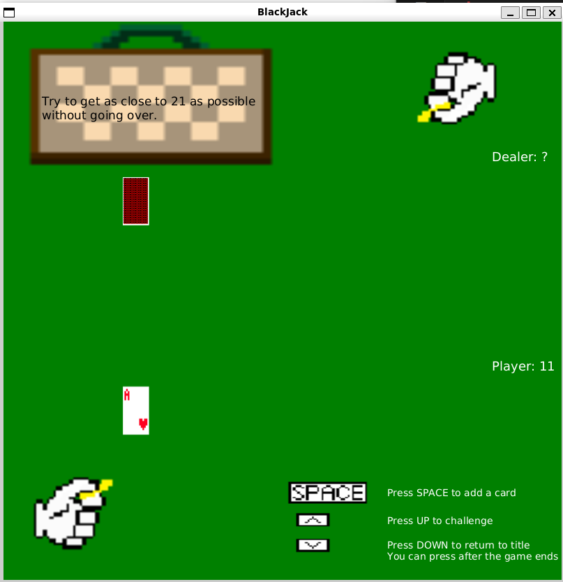
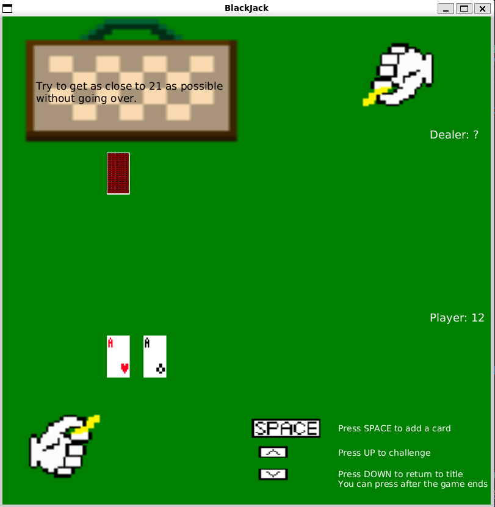
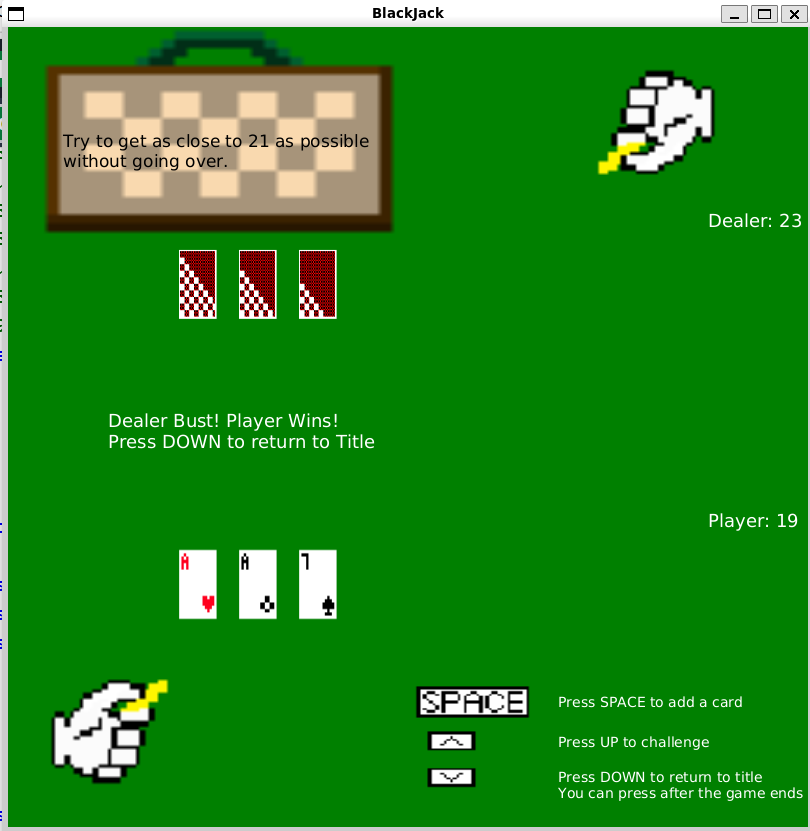
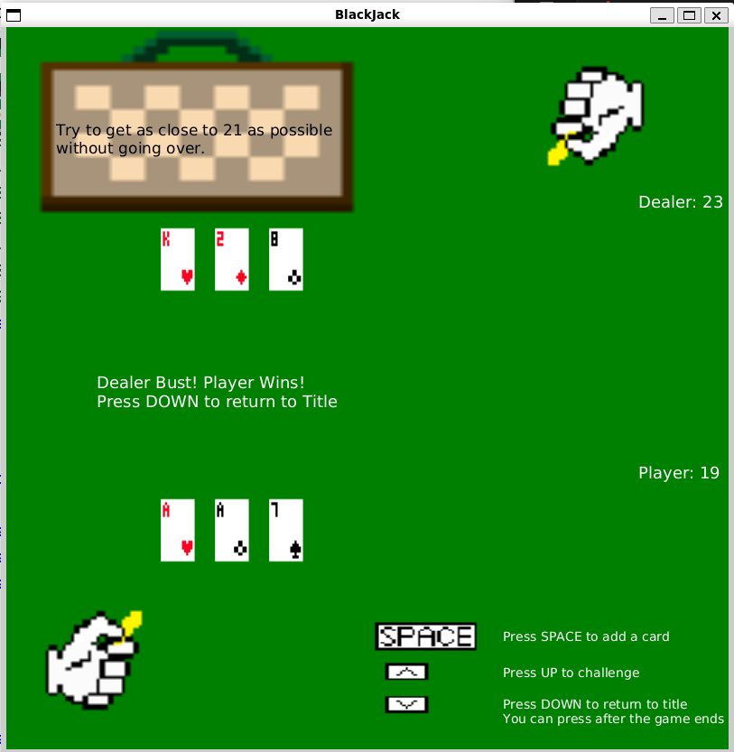

# BlackJack

## 解説

学校の課題で、Javaを使って制作したブラックジャック。ゲーム中に表示される画像はすべて自分で書いた。限られた時間と条件の中で楽しむことができるゲームが運が絡むブラックジャックだと考えたため作成した。
### ゲーム開始

「SPACEキー」でゲームスタート。
最初の手持ちカードの数字がプレイヤーの点数となる。

### アクション選択

カードを引く: 「SPACEキー」でカードを追加し、その数字を現在の点数に加算。点数が21を超えるとバーストし、即敗北。

勝負する: 「UPキー」でディーラーと勝負。バーストしていなければ、ディーラーがカードを引き、最終的な点数を比較する。

### 勝敗判定

プレイヤーの勝利: プレイヤーの点数がディーラーを上回る、またはディーラーがバーストした場合。

プレイヤーの敗北: ディーラーの点数がプレイヤーを上回る、またはプレイヤーがバーストした場合。

引き分け: 双方の点数が同じ、または両者がバーストした場合。

### カードのルール

K・Q・J: 10として扱う。

A: 1または11として、状況に応じて有利な方を自動適用。

## ゲーム画面

タイトル画面は以下の通り。

  

ゲーム中の画面は以下の通り。画面の右上と左下にある手はコインをいじっているような動作を続けている。

  

「SPACEキー」でカードを追加すると、画面外の右からプレイヤーの手元へカードが平行移動する。

  

「UPキー」で勝負をすると、ディーラーがカードを引き、ディーラのカードの左端から次第に表から裏へと変わる。

  

ゲーム結果の表示後、「DOWNキー」でスタート画面に戻る。

  

